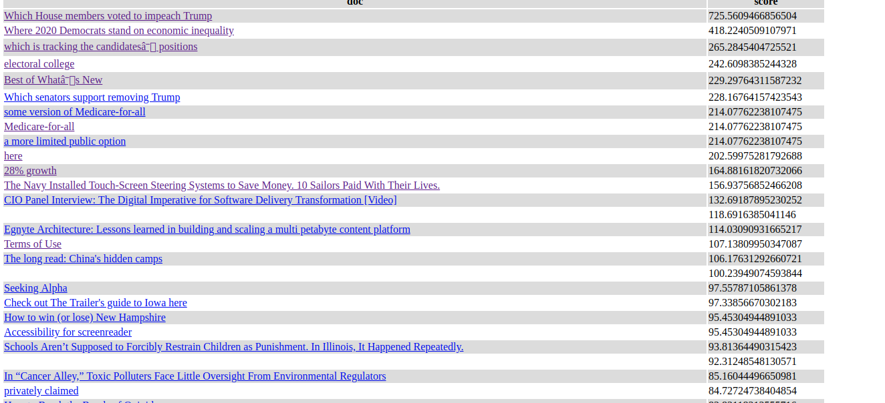

This project implements a web crawler which crawls all RSS and HTML documents beginning from an RSS feeds collection(OPML) and rates each document based on its information entropy value.

The **crawler** is implemented in **asyncrhronous event loop** instead of traditional **multi-thread** approach. The reasons are:
1. Python has bad support for multi-threading.
2. **Multi-thread** approach consumes a lot more system resources because each thread takes a lot of memory while each **asynchronous callback** takes much less memory. So **multi-threading** is more suitable for intensive computing tasks while **asysnchronous callback** is more suitable for simple tasks with long IO blocking time which is my **crawler**'s case.

I implemented the **asynchronous** approach using Python 3.8's [AsyncIO/Coroutine library](https://docs.python.org/3/library/asyncio-task.html) which supports `async/awwait` syntax. The `async/await` syntax enables it to pass an asynchronous callback around as well as allow any function to wait for the callback to be finished before continuing. It is really a powerful syntax to make our code cleaner and more readable. 

In my crawler, each url crawling and parsing is an asynchronous task. I put all **asynchronous** scheduling logic in [task_queue.py](task_queue.py) so that [crawl.py](crawl.py) could be concise and focus on overall structure. [task_queue.py](task_queue.py) controls the number of concurrent tasks so that there wouldn't be too many concurrent tasks. When crawler schedules a task, the task queue could either execute it directly or put the task on a waiting list based on the load. After one task finishes, the task queue starts another task on the waiting list. If all tasks have finished and the waiting list is also empty, the task queue will resolve an end Future to notify other routines that all the tasks are done. 

The task_queue is pretty complicated. So I added a [unit test](task_queue_test.py) for it.

The main logic is in [crawl.py](crawl.py). You can run `python3.8 crawl.py {opml_path} {max_html_depth}` to run crawler and rater. `opml_path` is the local OPML file path. `max_html_depth` is the maximum HTML bfs crawl depth which is used to save time during test.

The crawler crawls 3 different types of files: **OPML**, **RSS** and **HTML**. **OPML** is an XML extension describing RSS channels subscription and is exported from RSS reader. I added a [sample **OPML** file](example.opml) to this repo. **RSS** is an XML web feed format. I use [lxml library](https://lxml.de/index.html) as general document parser because it supports both XML and HTML parsing well. 

The crawler first loads and parses the OPML file to get all RSS feeds' URLs. Then it fetches RSS feeds and gets all HTML contents' URLs. Finally it fetches and parses and rates HTML contents. It also has a visited URL set to avoid duplicate visits to same URL. 

I also put many special logic in separate files. 

The [store.py](store.py) saves crawled result to some store like database. Right now I have implemented a **HtmlStore** which prints the result to a HTML file to simplify the testing work. There is a [sample result page](example_result.html) in this repository. And here is a screenshot of it. The left column is the document's title. The right column is the document's score. The whole table is sorted by the score. 

The [html_extractor.py](html_extractor.py) extracts text contents to be rated from a HTML document. Right now, it extracts only paragraph(\
) tag's content since most news information is in this tag. It also extracts same origin links from the HTML document for crawler to crawl. 

The [score.py](score.py) rates a text content using word entropy. Word entropy is similar to information entropy in information theory. It equals to sum(p * log p) over all words in the text content where p is probability of a word. A single word's entroy value comes from existing statistics in [word_entropy.csv](word_entropy.csv). word_entrophy.csv contains the entropy value p * log(p) per word. It is generated from [the word frequency data](https://www.kaggle.com/rtatman/english-word-frequency) which has counts of 333,333 words.